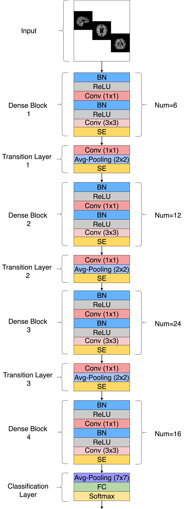
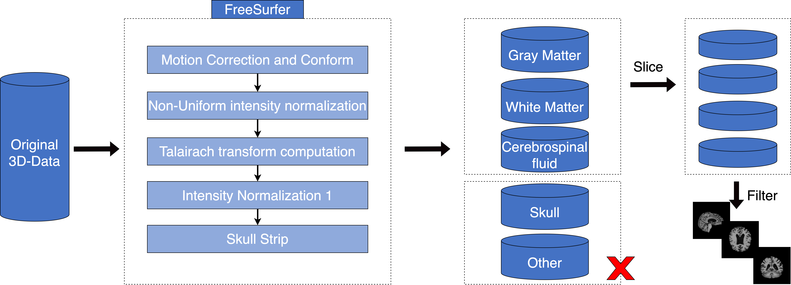
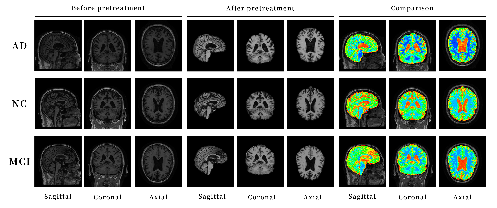
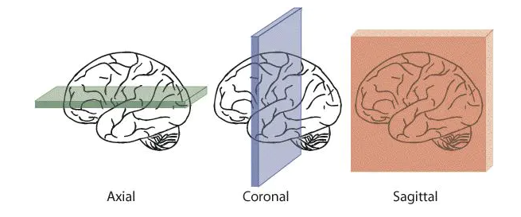
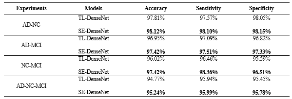
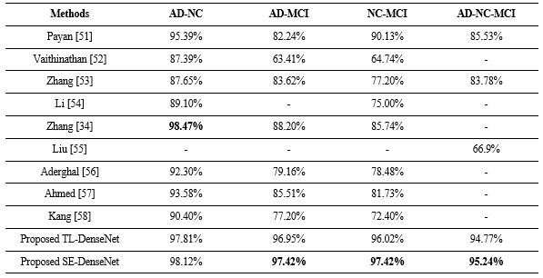
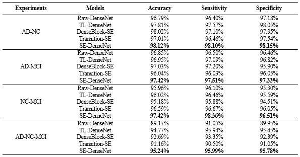
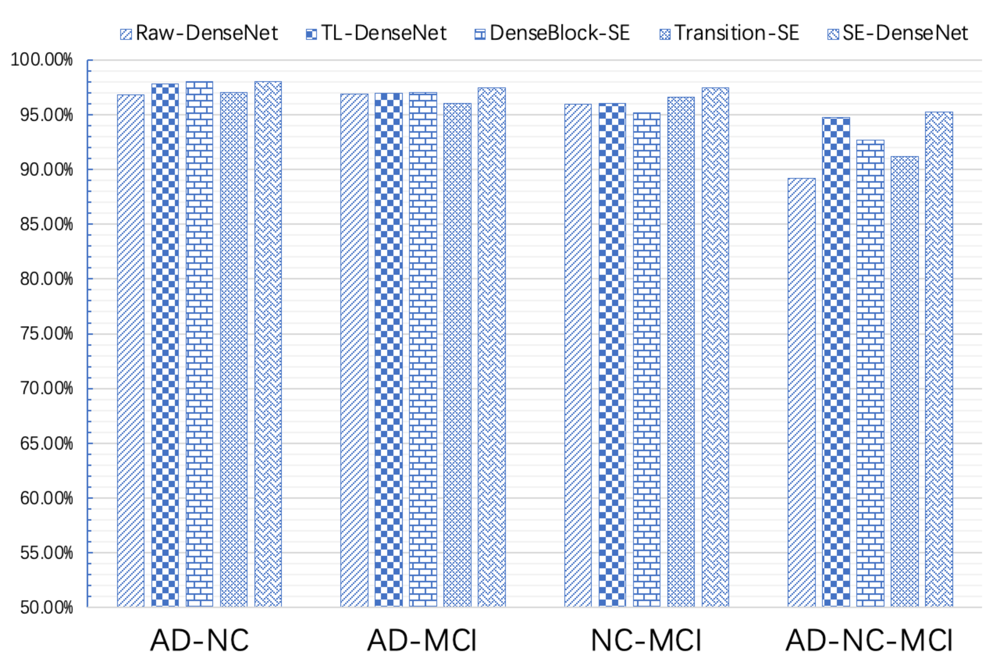
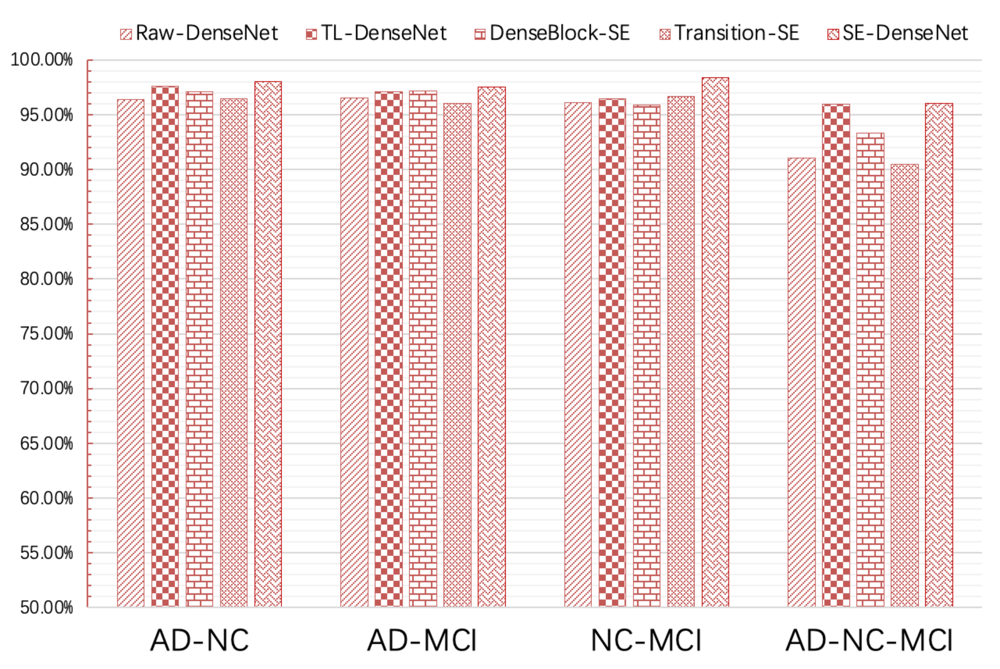
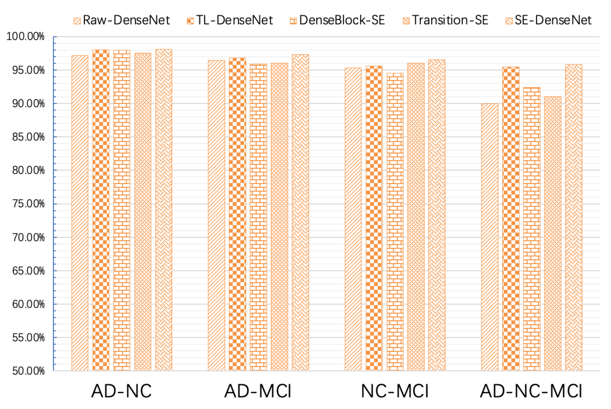

# SE-DenseNet-for-Alzheimer
SE-DenseNet: A Channel Attention Dense Hybrid Network for Alzheimer's Disease Classification Based on sMRI

## Introduction
This repository contains an implementation of a deep neural network architecture combining both SENet and DenseNet , which is able to learn from the sMRI data in an end-to-end manner to classify Alzheimer's disease.




## Python dependencies
Required packages can be installed on **python3.7** environment via command:

```py
cd Environments
pip install -r AD-Classification-Environment.txt
```

Nvidia GPU with Cuda 11.7 are required for training models.

## Repository structure
The structure of the current code repository is as follows:
* ```Data```: Under the folder, we provide all the data used by our code, including the CSV file of the original data (readers can further view it from the official website of ADNI) and the experimental data after various pre-processing.

* ```Environments```: This folder provides the environmental dependencies used in our experiments.

* ```Experiment```: In this folder, there are specific details of our experiment, which are further divided into four types of experiments: AD-NC, AD-MCI, NC-MCI, and AD-NC-MCI, and also include various ablation experiments for the experiment.

* ```Model```: This folder provides the main constituent details of the model.

* ```MRI_Preprocess```: This folder provides details of data processing. Our main task is to use the FreeSurfer image analysis toolbox for preprocessing, and then perform slicing operations using the image entropy information algorithm.

## Data

#### Data availability


Data used in preparation of this article were obtained from the Alzheimer’s Disease Neuroimaging Initiative (ADNI) database (adni.loni.usc.edu).

We have provided **CSV files** for three types of subjects in the **Data** folder, and readers can further view detailed information from the ADNI official website based on the subjects.


#### Data preprocessing
The original MRI images contain structures such as the skull and cerebellum that are irrelevant to the target information and increase computational workload, which can affect experimental results. Therefore, it is necessary to remove these unnecessary details that may reduce the classification accuracy of the model. We use the **FreeSurfer** image analysis toolbox for preprocessing, and the basic process is as follows:




The images of AD, NC, and MCI before and after preprocessing, as well as their comparison in HSV, are shown in Figure.



#### Data Slicing
The original sMRI sampling of each subject is 3D images, including transverse, Coronal plane and Sagittal plane planes. Their manifestations are as follows.



We're on **MRI_Preprocess** folder provides various batch processing operations for data preprocessing.

* BET.sh  
Perform a skull removal operation

* FLIRT.sh  
Register to MNI_152

* niiTo2d.py  
3D-Images To 2D-Images

* nii_process.ipynb  
Using Image Information Entropy Algorithm for Slice Selection and Fusion of Subjects under Different Categories

## How to run the Model Training & Testing
Due to we use of **Jupyter Notebook** files to organize our experiments, readers can directly access the **Experiment** folder and run the relevant experiments with one click.


## Experiment and Results

We have presented our experimental results in three convenient ways:

* TL DenseNet vs SE DenseNet

* Baseline Models vs SE DenseNet

* Ablation Results

#### Comparison of TL-DenseNet and SE-DenseNet Experimental Results



#### Comparison of Baseline Models and Our Models (Accuracy)



#### Comparison of Ablation Test Results



Comparing the accuracy, sensitivity, and specificity respectively based on the results of the ablative experiments. It is clearer and more intuitive to highlight the enhancement of various aspects of the backbone convolutional neural network by the channel attention mechanism.


**Ablation-Acc**


**Ablation-Sen**


**Ablation-Spec**
